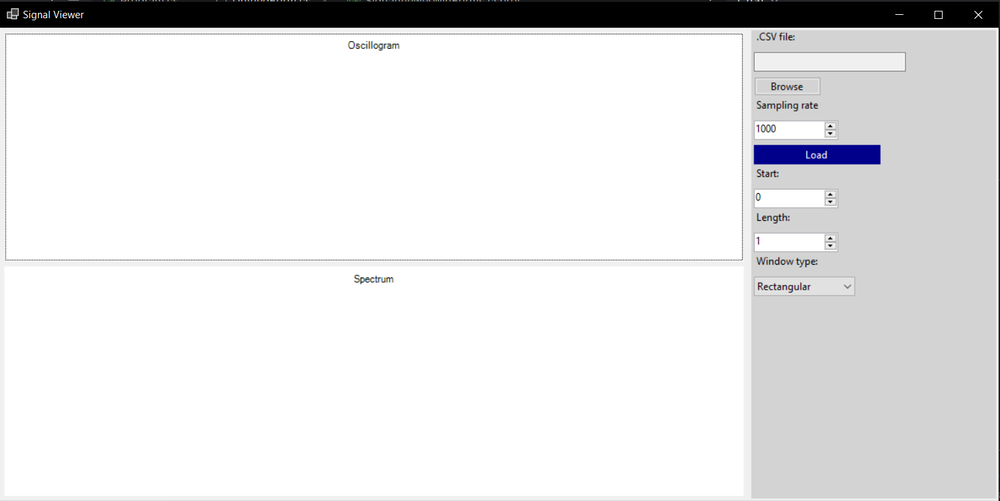

# Signal Viewer WinForms

A desktop application written in C# using WinForms that allows users to load and analyze time-domain signals from `.csv` files. The application visualizes both the signal waveform (oscillogram) and its frequency content (spectrum via FFT).

---

## ✨ Features

- 📁 **CSV Signal File Loader**  
  Easily browse and load `.csv` files containing numeric signal samples.

- 📊 **Oscillogram and Spectrum Charts**  
  View the time-domain signal and its frequency domain transform using Fast Fourier Transform (FFT).

- 🎚 **Interactive Fragment Selection**  
  - Choose the **start sample** and **number of samples** for analysis  
  - Maximum length defaults to file size, adjustable downward

- 🎛️ **Sampling Rate Input**  
  Input or adjust the sampling rate (in Hz) for accurate frequency scaling.

- 🪟 **Window Function Selection**  
  Apply different windowing functions:
  - Rectangular (default)
  - Hann
  - Hamming

- 🎨 **Styled Buttons & UI**  
  Includes custom colors and rounded buttons for a modern look.

## 🏗️ Building the Project

Ensure you have the .NET 8 SDK installed. Then run:

